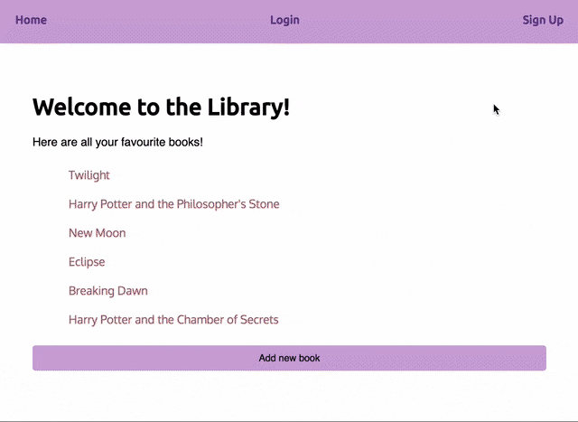

# Kai and Steph's Library

Upload your favourite books and authors here.

### To run this project

- First `git clone` this repository
- `cd` into repo and install requirements:
    `pipenv install -r requirements.txt`
- Run `pipenv shell` and then `cd library`
- Start the server by running `python manage.py runserver`
- Go to `http://localhost:8000/` to see the app in action

### Technologies
- HTML | CSS | Python | Django | SQL

### Wins and Challenges

- Users can register and login.
- Users can store information in the database.
- Users can see if a book is available to borrow or not.
- Users can upload a new book to their account.

### Future Features

- Develop the UI with CSS.